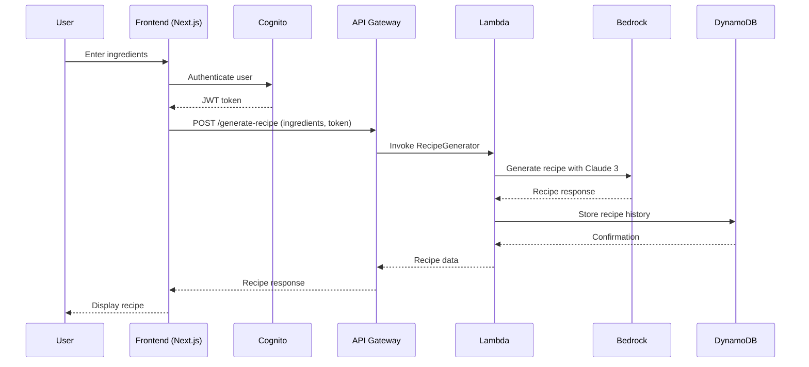

# Design Document: AI Recipe Generator

## Overview

A serverless AI Recipe Generator application that leverages AWS services to provide users with personalized recipe recommendations based on available ingredients. The system uses Amazon Bedrock's Claude 3 for intelligent recipe generation, Cognito for authentication, and DynamoDB for recipe history storage.

## Main Algorithm/Workflow



## Core Interfaces/Types

```typescript
interface RecipeRequest {
  ingredients: string[]
  dietaryRestrictions?: string[]
  cuisine?: string
  servings?: number
}

interface Recipe {
  id: string
  title: string
  ingredients: Ingredient[]
  instructions: string[]
  prepTime: number
  cookTime: number
  servings: number
  nutritionInfo?: NutritionInfo
  createdAt: string
}

interface Ingredient {
  name: string
  amount: string
  unit: string
}

interface UserRecipeHistory {
  userId: string
  recipes: Recipe[]
  favorites: string[]
}

interface BedrockRequest {
  modelId: string
  contentType: string
  accept: string
  body: string
}
```

## Key Functions with Formal Specifications

### Function 1: generateRecipe()

```typescript
async function generateRecipe(request: RecipeRequest, userId: string): Promise<Recipe>
```

**Preconditions:**
- `request.ingredients` is non-empty array with valid ingredient names
- `userId` is authenticated and valid
- Bedrock service is available and accessible
- `request.servings` is positive integer if provided

**Postconditions:**
- Returns valid Recipe object with all required fields
- Recipe is stored in DynamoDB with user association
- Generated recipe uses at least 80% of provided ingredients
- Recipe instructions are clear and sequential

**Loop Invariants:** N/A (async function, no explicit loops)

### Function 2: authenticateUser()

```typescript
async function authenticateUser(token: string): Promise<CognitoUser>
```

**Preconditions:**
- `token` is non-null JWT string
- Cognito user pool is configured and accessible

**Postconditions:**
- Returns valid CognitoUser object if token is valid
- Throws AuthenticationError if token is invalid or expired
- No side effects on user data

**Loop Invariants:** N/A

### Function 3: storeRecipeHistory()

```typescript
async function storeRecipeHistory(userId: string, recipe: Recipe): Promise<void>
```

**Preconditions:**
- `userId` is valid and authenticated
- `recipe` is complete Recipe object
- DynamoDB table exists and is accessible

**Postconditions:**
- Recipe is stored in user's history
- Recipe ID is unique within user's collection
- Storage operation is idempotent
- Throws StorageError if operation fails

**Loop Invariants:** N/A

## Algorithmic Pseudocode

### Main Recipe Generation Algorithm

```pascal
ALGORITHM generateRecipeWorkflow(request, authToken)
INPUT: request of type RecipeRequest, authToken of type string
OUTPUT: recipe of type Recipe

BEGIN
  ASSERT request.ingredients.length > 0
  ASSERT authToken IS NOT NULL
  
  // Step 1: Authenticate user
  user ← authenticateUser(authToken)
  ASSERT user.isValid() = true
  
  // Step 2: Prepare Bedrock prompt
  prompt ← buildRecipePrompt(request)
  bedrockRequest ← {
    modelId: "anthropic.claude-3-sonnet-20240229-v1:0",
    contentType: "application/json",
    accept: "application/json",
    body: JSON.stringify({
      anthropic_version: "bedrock-2023-05-31",
      max_tokens: 2000,
      messages: [{
        role: "user",
        content: prompt
      }]
    })
  }
  
  // Step 3: Generate recipe with Bedrock
  response ← bedrock.invokeModel(bedrockRequest)
  rawRecipe ← parseBedrockResponse(response)
  
  // Step 4: Structure and validate recipe
  recipe ← structureRecipe(rawRecipe, request)
  ASSERT validateRecipe(recipe) = true
  
  // Step 5: Store in user history
  storeRecipeHistory(user.id, recipe)
  
  ASSERT recipe.isComplete() AND recipe.isValid()
  
  RETURN recipe
END
```

**Preconditions:**
- AWS services are configured and accessible
- User has valid authentication token
- Request contains valid ingredients list
- Bedrock model is available

**Postconditions:**
- Valid recipe is generated and returned
- Recipe is stored in user's history
- All AWS service calls are properly handled
- Error states are managed gracefully

**Loop Invariants:** N/A (sequential algorithm)

### User Authentication Algorithm

```pascal
ALGORITHM authenticateUser(token)
INPUT: token of type string
OUTPUT: user of type CognitoUser

BEGIN
  ASSERT token IS NOT NULL AND token IS NOT EMPTY
  
  // Verify JWT token with Cognito
  TRY
    payload ← cognito.verifyToken(token)
    
    IF payload.exp < currentTime() THEN
      THROW AuthenticationError("Token expired")
    END IF
    
    user ← {
      id: payload.sub,
      username: payload.username,
      email: payload.email,
      isValid: true
    }
    
    RETURN user
    
  CATCH error
    THROW AuthenticationError("Invalid token: " + error.message)
  END TRY
END
```

**Preconditions:**
- token parameter is provided (may be invalid)
- Cognito service is accessible
- JWT verification keys are available

**Postconditions:**
- Returns valid user object if authentication succeeds
- Throws AuthenticationError with descriptive message if authentication fails
- No side effects on user data or system state

**Loop Invariants:** N/A

### Recipe Prompt Building Algorithm

```pascal
ALGORITHM buildRecipePrompt(request)
INPUT: request of type RecipeRequest
OUTPUT: prompt of type string

BEGIN
  ASSERT request.ingredients.length > 0
  
  prompt ← "Generate a detailed recipe using the following ingredients: "
  
  // Add ingredients with proper formatting
  FOR each ingredient IN request.ingredients DO
    prompt ← prompt + ingredient + ", "
  END FOR
  
  // Remove trailing comma and space
  prompt ← prompt.substring(0, prompt.length - 2)
  
  // Add dietary restrictions if provided
  IF request.dietaryRestrictions IS NOT NULL AND request.dietaryRestrictions.length > 0 THEN
    prompt ← prompt + ". Dietary restrictions: "
    FOR each restriction IN request.dietaryRestrictions DO
      prompt ← prompt + restriction + ", "
    END FOR
    prompt ← prompt.substring(0, prompt.length - 2)
  END IF
  
  // Add cuisine preference if provided
  IF request.cuisine IS NOT NULL THEN
    prompt ← prompt + ". Cuisine style: " + request.cuisine
  END IF
  
  // Add servings if provided
  IF request.servings IS NOT NULL THEN
    prompt ← prompt + ". Servings: " + request.servings
  END IF
  
  // Add formatting instructions
  prompt ← prompt + ". Please provide the recipe in JSON format with fields: title, ingredients (with amounts), instructions (step by step), prepTime (minutes), cookTime (minutes), servings, and nutritionInfo (calories, protein, carbs, fat)."
  
  RETURN prompt
END
```

**Preconditions:**
- request.ingredients contains at least one valid ingredient
- All optional fields are properly typed if provided

**Postconditions:**
- Returns well-formatted prompt string for Bedrock
- Prompt includes all provided parameters
- Prompt requests structured JSON response
- Prompt is within Bedrock token limits

**Loop Invariants:**
- All processed ingredients are included in prompt
- Prompt remains valid throughout construction

## Example Usage

```typescript
// Example 1: Basic recipe generation
const request: RecipeRequest = {
  ingredients: ["chicken breast", "broccoli", "rice"],
  servings: 4
}
const authToken = "eyJhbGciOiJSUzI1NiIsInR5cCI6IkpXVCJ9..."
const recipe = await generateRecipe(request, authToken)

// Example 2: Recipe with dietary restrictions
const restrictedRequest: RecipeRequest = {
  ingredients: ["tofu", "vegetables", "quinoa"],
  dietaryRestrictions: ["vegan", "gluten-free"],
  cuisine: "Mediterranean",
  servings: 2
}

// Example 3: Complete workflow with error handling
try {
  const user = await authenticateUser(authToken)
  if (user.isValid) {
    const recipe = await generateRecipeWorkflow(request, authToken)
    await displayRecipe(recipe)
  }
} catch (error) {
  if (error instanceof AuthenticationError) {
    redirectToLogin()
  } else {
    displayError(error.message)
  }
}

// Example 4: Lambda handler implementation
export const handler = async (event: APIGatewayProxyEvent): Promise<APIGatewayProxyResult> => {
  try {
    const request: RecipeRequest = JSON.parse(event.body || '{}')
    const authToken = event.headers.Authorization?.replace('Bearer ', '')
    
    if (!authToken) {
      return {
        statusCode: 401,
        body: JSON.stringify({ error: 'Missing authentication token' })
      }
    }
    
    const recipe = await generateRecipeWorkflow(request, authToken)
    
    return {
      statusCode: 200,
      headers: {
        'Content-Type': 'application/json',
        'Access-Control-Allow-Origin': '*'
      },
      body: JSON.stringify(recipe)
    }
  } catch (error) {
    return {
      statusCode: error instanceof AuthenticationError ? 401 : 500,
      body: JSON.stringify({ error: error.message })
    }
  }
}
```

## Correctness Properties

```typescript
// Property 1: Recipe generation always produces valid recipes
∀ request: RecipeRequest, token: string, recipe: Recipe
  (isValidRequest(request) ∧ isValidToken(token)) 
  ⟹ (generateRecipe(request, token) = recipe ⟹ isValidRecipe(recipe))

// Property 2: Authentication is consistent
∀ token: string, user1: CognitoUser, user2: CognitoUser
  (authenticateUser(token) = user1 ∧ authenticateUser(token) = user2) 
  ⟹ user1.id = user2.id

// Property 3: Recipe storage is persistent
∀ userId: string, recipe: Recipe
  storeRecipeHistory(userId, recipe) 
  ⟹ ∃ history: UserRecipeHistory (history.userId = userId ∧ recipe ∈ history.recipes)

// Property 4: Ingredient utilization
∀ request: RecipeRequest, recipe: Recipe
  generateRecipe(request, _) = recipe 
  ⟹ |usedIngredients(recipe) ∩ request.ingredients| ≥ 0.8 × |request.ingredients|

// Property 5: Recipe uniqueness per user
∀ userId: string, recipe1: Recipe, recipe2: Recipe
  (recipe1 ∈ getUserRecipes(userId) ∧ recipe2 ∈ getUserRecipes(userId) ∧ recipe1 ≠ recipe2) 
  ⟹ recipe1.id ≠ recipe2.id
```