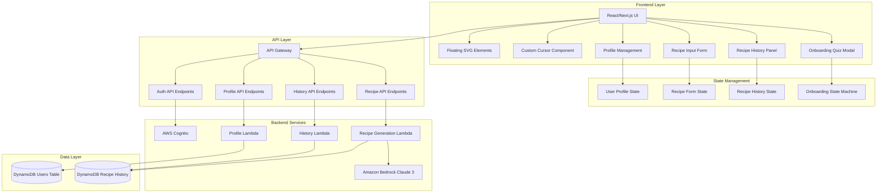
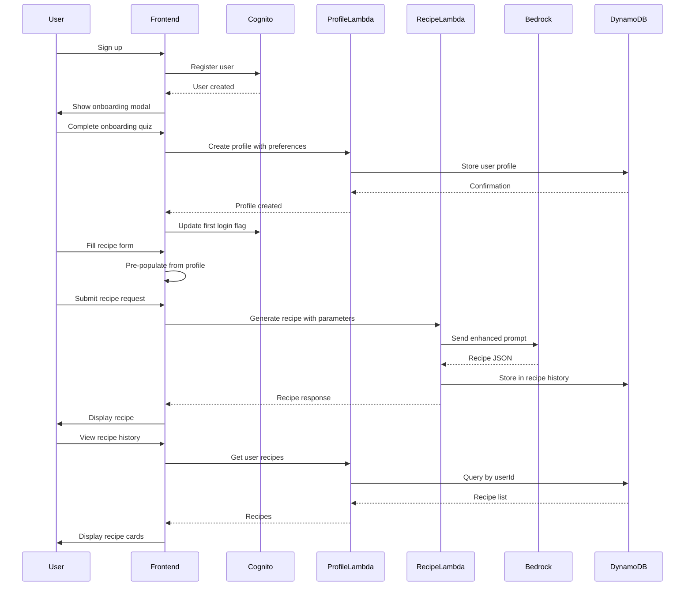
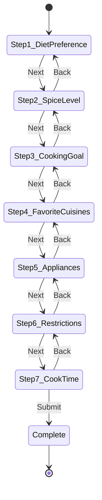

# Design Document: Frontend Redesign V2

## Overview

The Frontend Redesign V2 transforms the AI Recipe Generator into an engaging, personalized web application with animated visual elements, comprehensive user profile management, first-time onboarding, and enhanced recipe generation controls. The redesign maintains the existing AWS backend infrastructure (Cognito, Lambda, DynamoDB, Bedrock) while introducing a modern React/Next.js frontend with CSS animations, custom cursor interactions, and sophisticated state management.

The system architecture follows a serverless pattern where the React frontend communicates with AWS services through API Gateway endpoints. User profiles and recipe history are stored in DynamoDB, authentication is handled by Cognito, and recipe generation leverages Amazon Bedrock's Claude 3 model with enhanced prompt engineering.

## Architecture

### System Architecture Diagram



### Component Hierarchy

```mermaid
graph TD
    App[App Component]
    App --> Layout[Layout Component]
    Layout --> FloatingBg[FloatingBackground]
    Layout --> CursorProvider[CustomCursorProvider]
    Layout --> Header[Header]
    Layout --> Router[Router]
    
    Router --> HomePage[HomePage]
    Router --> ProfilePage[ProfilePage]
    Router --> HistoryPage[HistoryPage]
    
    HomePage --> OnboardingModal[OnboardingModal]
    HomePage --> RecipeForm[RecipeForm]
    HomePage --> RecipeDisplay[RecipeDisplay]
    
    OnboardingModal --> Step1[Diet Preference Step]
    OnboardingModal --> Step2[Spice Level Step]
    OnboardingModal --> Step3[Cooking Goal Step]
    OnboardingModal --> Step4[Favorite Cuisines Step]
    OnboardingModal --> Step5[Appliances Step]
    OnboardingModal --> Step6[Restrictions Step]
    OnboardingModal --> Step7[Cook Time Step]
    
    RecipeForm --> DietToggle[Diet Type Toggle]
    RecipeForm --> MealSelector[Meal Type Selector]
    RecipeForm --> CuisineChips[Cuisine Chips]
    RecipeForm --> StyleSelector[Cooking Style Selector]
    RecipeForm --> ApplianceIcons[Appliance Icons]
    RecipeForm --> PantryToggles[Pantry Staples]
    RecipeForm --> SpiceSlider[Spice Level Slider]
    RecipeForm --> HealthGoal[Health Goal Selector]
    RecipeForm --> TimeSlider[Cook Time Slider]
    RecipeForm --> IngredientInput[Ingredient Input]
    RecipeForm --> VoiceButton[Voice Input Button]
    
    ProfilePage --> ProfileHeader[Profile Header]
    ProfilePage --> PreferencesForm[Preferences Form]
    ProfilePage --> SaveButton[Save Button]
    
    HistoryPage --> FilterBar[Filter Bar]
    HistoryPage --> RecipeGrid[Recipe Grid]
    RecipeGrid --> RecipeCard[Recipe Card]
```




### Data Flow Diagram



## Components and Interfaces

### Core Type Definitions

```typescript
// User Profile Types
interface UserProfile {
  userId: string
  displayName: string
  email: string
  dietPreference: DietType
  spiceLevel: SpiceLevel
  cookingGoal: CookingGoal
  favoriteCuisines: string[]
  availableAppliances: Appliance[]
  dietaryRestrictions: string[]
  usualCookingTime: string
  hasCompletedOnboarding: boolean
  createdAt: string
  updatedAt: string
}

type DietType = 'Vegetarian' | 'Non-Vegetarian' | 'Vegan' | 'Eggetarian'
type SpiceLevel = 'Mild' | 'Medium' | 'Spicy' | 'Very Spicy' | 'Extra spicy'
type CookingGoal = 'Fitness' | 'Taste' | 'Balanced' | 'Quick'
type Appliance = 'Stove' | 'Oven' | 'Microwave' | 'Air Fryer' | 'Pressure Cooker' | 'Blender' | 'Grill'

// Recipe Types
interface RecipeRequest {
  ingredients: string[]
  dietType: DietType
  mealType: MealType
  cuisine: string
  cookingStyle: CookingStyle
  availableAppliances: Appliance[]
  pantryStaples: string[]
  spiceLevel: SpiceLevel
  healthGoal: CookingGoal
  cookTime: number
  dietaryRestrictions?: string[]
}

type MealType = 'Breakfast' | 'Lunch' | 'Snack' | 'Dinner' | 'Dessert'
type CookingStyle = 'Curry' | 'Dry' | 'Deep fry' | 'Semi-curry' | 'Steamed' | 'Baked' | 'Grilled' | 'Salad'

interface Recipe {
  recipeId: string
  userId: string
  recipeName: string
  recipeDescription: string
  ingredients: Ingredient[]
  instructions: string[]
  nutritionInfo: NutritionInfo
  difficulty: string
  variationTips: string[]
  cuisine: string
  mealType: MealType
  cookTime: number
  isFavorite: boolean
  createdAt: string
}

interface Ingredient {
  name: string
  amount: string
  unit: string
}

interface NutritionInfo {
  calories: number
  protein: number
  carbs: number
  fat: number
}

// Onboarding State Machine
interface OnboardingState {
  currentStep: number
  totalSteps: number
  responses: OnboardingResponses
  isComplete: boolean
}

interface OnboardingResponses {
  dietPreference?: DietType
  spiceLevel?: SpiceLevel
  cookingGoal?: CookingGoal
  favoriteCuisines?: string[]
  availableAppliances?: Appliance[]
  dietaryRestrictions?: string[]
  usualCookingTime?: string
}

// Recipe Form State
interface RecipeFormState {
  dietType: DietType
  mealType: MealType
  cuisine: string
  cookingStyle: CookingStyle
  availableAppliances: Appliance[]
  pantryStaples: Set<string>
  spiceLevel: SpiceLevel
  healthGoal: CookingGoal
  cookTime: number
  ingredients: string
  isVoiceActive: boolean
  isGenerating: boolean
}
```


## Data Models

### DynamoDB Users Table Schema

```typescript
// Table Name: Users
// Primary Key: userId (String)

interface UsersTableItem {
  userId: string              // Partition key (Cognito sub)
  displayName: string         // User's display name
  email: string              // User's email address
  dietPreference: string     // Vegetarian | Non-Vegetarian | Vegan | Eggetarian
  spiceLevel: string         // Mild | Medium | Spicy | Very Spicy
  cookingGoal: string        // Fitness | Taste | Balanced | Quick
  favoriteCuisines: string[] // Array of cuisine preferences
  availableAppliances: string[] // Array of appliance names
  dietaryRestrictions: string[] // Array of restrictions/allergies
  usualCookingTime: string   // Under 15min | 15-30min | 30-60min | Over 1hr
  hasCompletedOnboarding: boolean // First-time onboarding flag
  createdAt: string          // ISO 8601 timestamp
  updatedAt: string          // ISO 8601 timestamp
}

// Example Item:
{
  "userId": "abc123-def456-ghi789",
  "displayName": "John Doe",
  "email": "john@example.com",
  "dietPreference": "Vegetarian",
  "spiceLevel": "Medium",
  "cookingGoal": "Balanced",
  "favoriteCuisines": ["Italian", "Indian", "Thai"],
  "availableAppliances": ["Stove", "Oven", "Microwave"],
  "dietaryRestrictions": ["Gluten-free"],
  "usualCookingTime": "30-60min",
  "hasCompletedOnboarding": true,
  "createdAt": "2024-01-15T10:30:00Z",
  "updatedAt": "2024-01-20T14:45:00Z"
}
```

### DynamoDB Recipe History Table Schema

```typescript
// Table Name: RecipeHistory
// Primary Key: userId (Partition Key), recipeId (Sort Key)

interface RecipeHistoryTableItem {
  userId: string              // Partition key
  recipeId: string           // Sort key (UUID)
  recipeName: string         // Recipe title
  recipeDescription: string  // Brief description
  ingredients: IngredientItem[] // List of ingredients with quantities
  instructions: string[]     // Step-by-step instructions
  nutritionInfo: {           // Nutrition information object
    calories: number
    protein: number
    carbs: number
    fat: number
  }
  difficulty: string         // Easy | Medium | Hard
  variationTips: string[]    // Array of variation suggestions
  cuisine: string            // Cuisine type
  mealType: string          // Breakfast | Lunch | Snack | Dinner | Dessert
  cookTime: number          // Cook time in minutes
  isFavorite: boolean       // Favorite flag
  createdAt: string         // ISO 8601 timestamp
}

interface IngredientItem {
  name: string
  amount: string
  unit: string
}

// Example Item:
{
  "userId": "abc123-def456-ghi789",
  "recipeId": "recipe-uuid-12345",
  "recipeName": "Vegetarian Pasta Primavera",
  "recipeDescription": "A light and fresh pasta dish with seasonal vegetables",
  "ingredients": [
    { "name": "pasta", "amount": "400", "unit": "g" },
    { "name": "bell peppers", "amount": "2", "unit": "whole" },
    { "name": "zucchini", "amount": "1", "unit": "whole" }
  ],
  "instructions": [
    "Boil pasta according to package directions",
    "Sauté vegetables in olive oil",
    "Combine pasta and vegetables"
  ],
  "nutritionInfo": {
    "calories": 450,
    "protein": 15,
    "carbs": 65,
    "fat": 12
  },
  "difficulty": "Easy",
  "variationTips": [
    "Add grilled chicken for extra protein",
    "Use whole wheat pasta for more fiber"
  ],
  "cuisine": "Italian",
  "mealType": "Dinner",
  "cookTime": 30,
  "isFavorite": true,
  "createdAt": "2024-01-20T18:30:00Z"
}
```

### API Endpoint Specifications

#### Profile Management Endpoints

```typescript
// GET /profile
// Retrieve user profile
interface GetProfileRequest {
  headers: {
    Authorization: string // Bearer JWT token
  }
}

interface GetProfileResponse {
  profile: UserProfile
}

// PUT /profile
// Update user profile
interface UpdateProfileRequest {
  headers: {
    Authorization: string
  }
  body: {
    displayName?: string
    dietPreference?: DietType
    spiceLevel?: SpiceLevel
    cookingGoal?: CookingGoal
    favoriteCuisines?: string[]
    availableAppliances?: Appliance[]
    dietaryRestrictions?: string[]
    usualCookingTime?: string
  }
}

interface UpdateProfileResponse {
  profile: UserProfile
  message: string
}

// POST /profile/onboarding
// Create initial profile after onboarding
interface CreateProfileRequest {
  headers: {
    Authorization: string
  }
  body: OnboardingResponses & {
    displayName: string
    email: string
  }
}

interface CreateProfileResponse {
  profile: UserProfile
  message: string
}
```


#### Recipe History Endpoints

```typescript
// GET /recipes
// Retrieve all recipes for authenticated user
interface GetRecipesRequest {
  headers: {
    Authorization: string
  }
  queryParams?: {
    cuisine?: string
    mealType?: MealType
    limit?: number
    lastEvaluatedKey?: string // For pagination
  }
}

interface GetRecipesResponse {
  recipes: Recipe[]
  lastEvaluatedKey?: string
  count: number
}

// GET /recipes/:recipeId
// Retrieve single recipe by ID
interface GetRecipeRequest {
  headers: {
    Authorization: string
  }
  params: {
    recipeId: string
  }
}

interface GetRecipeResponse {
  recipe: Recipe
}

// PUT /recipes/:recipeId/favorite
// Toggle favorite status
interface UpdateFavoriteRequest {
  headers: {
    Authorization: string
  }
  params: {
    recipeId: string
  }
  body: {
    isFavorite: boolean
  }
}

interface UpdateFavoriteResponse {
  recipe: Recipe
  message: string
}

// DELETE /recipes/:recipeId
// Delete recipe from history
interface DeleteRecipeRequest {
  headers: {
    Authorization: string
  }
  params: {
    recipeId: string
  }
}

interface DeleteRecipeResponse {
  message: string
  deletedRecipeId: string
}
```

#### Enhanced Recipe Generation Endpoint

```typescript
// POST /generate-recipe
// Generate recipe with comprehensive parameters
interface GenerateRecipeRequest {
  headers: {
    Authorization: string
  }
  body: {
    ingredients: string[]
    dietType: DietType
    mealType: MealType
    cuisine: string
    cookingStyle: CookingStyle
    availableAppliances: Appliance[]
    pantryStaples: string[]
    spiceLevel: SpiceLevel
    healthGoal: CookingGoal
    cookTime: number
    dietaryRestrictions?: string[]
  }
}

interface GenerateRecipeResponse {
  recipe: Recipe
  message: string
}
```

## CSS Animation Specifications

### Floating Elements Animation

```css
/* Floating background elements */
@keyframes float {
  0% {
    transform: translateY(0) translateX(0) rotate(0deg);
  }
  25% {
    transform: translateY(-20px) translateX(10px) rotate(5deg);
  }
  50% {
    transform: translateY(-40px) translateX(-10px) rotate(-5deg);
  }
  75% {
    transform: translateY(-20px) translateX(10px) rotate(5deg);
  }
  100% {
    transform: translateY(0) translateX(0) rotate(0deg);
  }
}

.floating-element {
  position: absolute;
  opacity: 0.08;
  animation: float var(--duration) ease-in-out infinite;
  animation-delay: var(--delay);
  transform: rotate(var(--rotation));
  pointer-events: none;
  z-index: 0;
}

/* Individual element variations */
.floating-element:nth-child(1) {
  --duration: 15s;
  --delay: 0s;
  --rotation: -10deg;
  top: 10%;
  left: 5%;
}

.floating-element:nth-child(2) {
  --duration: 20s;
  --delay: 2s;
  --rotation: 15deg;
  top: 30%;
  right: 10%;
}

/* Continue for 10-15 elements with varied timing and positions */
```

### Hover Effects

```css
/* Card hover effects */
.recipe-card {
  transition: transform 0.3s ease, box-shadow 0.3s ease, border-color 0.3s ease;
  border: 2px solid transparent;
}

.recipe-card:hover {
  transform: translateY(-8px) scale(1.02);
  box-shadow: 0 12px 24px rgba(0, 0, 0, 0.15);
  border-color: #667eea;
}

/* Button hover effects */
.btn-primary {
  transition: transform 0.2s ease, box-shadow 0.2s ease, background 0.2s ease;
}

.btn-primary:hover {
  transform: translateY(-2px);
  box-shadow: 0 6px 16px rgba(102, 126, 234, 0.4);
  background: linear-gradient(135deg, #7689f0 0%, #8557b2 100%);
}

/* Input focus effects */
.form-input {
  transition: border-color 0.3s ease, box-shadow 0.3s ease;
}

.form-input:focus {
  border-color: #667eea;
  box-shadow: 0 0 0 3px rgba(102, 126, 234, 0.1);
}
```

### Custom Cursor Implementation

```css
/* Base64 encoded frying pan SVG cursor */
.custom-cursor-area {
  cursor: url('data:image/svg+xml;base64,PHN2ZyB3aWR0aD0iMjgiIGhlaWdodD0iMjgiIHZpZXdCb3g9IjAgMCAyOCAyOCIgZmlsbD0ibm9uZSIgeG1sbnM9Imh0dHA6Ly93d3cudzMub3JnLzIwMDAvc3ZnIj4KICA8Y2lyY2xlIGN4PSIxMCIgY3k9IjEwIiByPSI4IiBzdHJva2U9IiMzMzMiIHN0cm9rZS13aWR0aD0iMiIgZmlsbD0iI2ZmZiIvPgogIDxsaW5lIHgxPSIxNiIgeTE9IjE2IiB4Mj0iMjQiIHkyPSIyNCIgc3Ryb2tlPSIjMzMzIiBzdHJva2Utd2lkdGg9IjIiIHN0cm9rZS1saW5lY2FwPSJyb3VuZCIvPgo8L3N2Zz4='), pointer;
}

/* Animated cursor for interactive elements */
@keyframes sizzle {
  0%, 100% { transform: translateX(0); }
  25% { transform: translateX(-1px); }
  75% { transform: translateX(1px); }
}

.custom-cursor-area button:hover,
.custom-cursor-area a:hover,
.custom-cursor-area .clickable:hover {
  cursor: url('data:image/svg+xml;base64,PHN2ZyB3aWR0aD0iMjgiIGhlaWdodD0iMjgiIHZpZXdCb3g9IjAgMCAyOCAyOCIgZmlsbD0ibm9uZSIgeG1sbnM9Imh0dHA6Ly93d3cudzMub3JnLzIwMDAvc3ZnIj4KICA8Y2lyY2xlIGN4PSIxMCIgY3k9IjEwIiByPSI4IiBzdHJva2U9IiNmZjY2MDAiIHN0cm9rZS13aWR0aD0iMiIgZmlsbD0iI2ZmZiIvPgogIDxsaW5lIHgxPSIxNiIgeTE9IjE2IiB4Mj0iMjQiIHkyPSIyNCIgc3Ryb2tlPSIjZmY2NjAwIiBzdHJva2Utd2lkdGg9IjIiIHN0cm9rZS1saW5lY2FwPSJyb3VuZCIvPgogIDxjaXJjbGUgY3g9IjEwIiBjeT0iNSIgcj0iMSIgZmlsbD0iI2ZmNjYwMCIgb3BhY2l0eT0iMC42Ii8+CiAgPGNpcmNsZSBjeD0iMTMiIGN5PSI3IiByPSIxIiBmaWxsPSIjZmY2NjAwIiBvcGFjaXR5PSIwLjYiLz4KPC9zdmc+'), pointer;
}

/* Disable custom cursor on touch devices */
@media (hover: none) and (pointer: coarse) {
  .custom-cursor-area {
    cursor: default;
  }
}
```


## Onboarding Quiz State Machine

### State Machine Diagram



### State Machine Implementation

```typescript
type OnboardingStep = 1 | 2 | 3 | 4 | 5 | 6 | 7

interface OnboardingStateMachine {
  currentStep: OnboardingStep
  responses: OnboardingResponses
  canGoNext: () => boolean
  canGoBack: () => boolean
  goNext: () => void
  goBack: () => void
  updateResponse: (key: keyof OnboardingResponses, value: any) => void
  submit: () => Promise<void>
}

class OnboardingMachine implements OnboardingStateMachine {
  currentStep: OnboardingStep = 1
  responses: OnboardingResponses = {}
  
  canGoNext(): boolean {
    switch (this.currentStep) {
      case 1: return !!this.responses.dietPreference
      case 2: return !!this.responses.spiceLevel
      case 3: return !!this.responses.cookingGoal
      case 4: return !!this.responses.favoriteCuisines && this.responses.favoriteCuisines.length > 0
      case 5: return !!this.responses.availableAppliances && this.responses.availableAppliances.length > 0
      case 6: return true // Optional step
      case 7: return !!this.responses.usualCookingTime
      default: return false
    }
  }
  
  canGoBack(): boolean {
    return this.currentStep > 1
  }
  
  goNext(): void {
    if (this.canGoNext() && this.currentStep < 7) {
      this.currentStep = (this.currentStep + 1) as OnboardingStep
    }
  }
  
  goBack(): void {
    if (this.canGoBack()) {
      this.currentStep = (this.currentStep - 1) as OnboardingStep
    }
  }
  
  updateResponse(key: keyof OnboardingResponses, value: any): void {
    this.responses[key] = value
  }
  
  async submit(): Promise<void> {
    if (this.currentStep === 7 && this.canGoNext()) {
      // Call API to create profile
      await createUserProfile(this.responses)
    }
  }
}
```

## Recipe Form State Management

### Form State Structure

```typescript
interface RecipeFormManager {
  state: RecipeFormState
  userProfile: UserProfile | null
  
  // Initialization
  initialize: (profile: UserProfile) => void
  
  // State updates
  setDietType: (diet: DietType) => void
  setMealType: (meal: MealType) => void
  setCuisine: (cuisine: string) => void
  setCookingStyle: (style: CookingStyle) => void
  toggleAppliance: (appliance: Appliance) => void
  togglePantryStaple: (staple: string) => void
  setSpiceLevel: (level: SpiceLevel) => void
  setHealthGoal: (goal: CookingGoal) => void
  setCookTime: (minutes: number) => void
  setIngredients: (ingredients: string) => void
  
  // Voice input
  startVoiceInput: () => void
  stopVoiceInput: () => void
  
  // Validation
  isValid: () => boolean
  
  // Submission
  generateRecipe: () => Promise<Recipe>
}

class RecipeFormState implements RecipeFormManager {
  state: RecipeFormState
  userProfile: UserProfile | null = null
  
  constructor() {
    this.state = this.getDefaultState()
  }
  
  private getDefaultState(): RecipeFormState {
    return {
      dietType: 'Vegetarian',
      mealType: 'Dinner',
      cuisine: '',
      cookingStyle: 'Curry',
      availableAppliances: [],
      pantryStaples: new Set(['Salt', 'Pepper', 'Oil', 'Garlic', 'Onion']),
      spiceLevel: 'Medium',
      healthGoal: 'Balanced',
      cookTime: 30,
      ingredients: '',
      isVoiceActive: false,
      isGenerating: false
    }
  }
  
  initialize(profile: UserProfile): void {
    this.userProfile = profile
    if (profile.hasCompletedOnboarding) {
      this.state.dietType = profile.dietPreference
      this.state.spiceLevel = profile.spiceLevel
      this.state.healthGoal = profile.cookingGoal
      this.state.availableAppliances = profile.availableAppliances
    }
  }
  
  isValid(): boolean {
    return this.state.ingredients.trim().length > 0
  }
  
  async generateRecipe(): Promise<Recipe> {
    if (!this.isValid()) {
      throw new Error('Invalid form state')
    }
    
    this.state.isGenerating = true
    
    const request: RecipeRequest = {
      ingredients: this.state.ingredients.split(',').map(i => i.trim()),
      dietType: this.state.dietType,
      mealType: this.state.mealType,
      cuisine: this.state.cuisine,
      cookingStyle: this.state.cookingStyle,
      availableAppliances: this.state.availableAppliances,
      pantryStaples: Array.from(this.state.pantryStaples),
      spiceLevel: this.state.spiceLevel,
      healthGoal: this.state.healthGoal,
      cookTime: this.state.cookTime,
      dietaryRestrictions: this.userProfile?.dietaryRestrictions
    }
    
    try {
      const recipe = await apiClient.generateRecipe(request)
      return recipe
    } finally {
      this.state.isGenerating = false
    }
  }
}
```


## Bedrock Prompt Template Structure

### Enhanced Prompt Builder

```typescript
function buildEnhancedBedrockPrompt(request: RecipeRequest): string {
  const parts: string[] = []
  
  // Base instruction
  parts.push("You are an expert chef and recipe creator. Generate a detailed, delicious recipe based on the following parameters:")
  
  // Ingredients
  parts.push(`\nIngredients available: ${request.ingredients.join(', ')}`)
  
  // Pantry staples
  if (request.pantryStaples.length > 0) {
    parts.push(`Pantry staples you can use: ${request.pantryStaples.join(', ')}`)
  }
  
  // Diet type
  parts.push(`\nDiet type: ${request.dietType}`)
  
  // Meal type
  parts.push(`Meal type: ${request.mealType}`)
  
  // Cuisine preference
  if (request.cuisine) {
    parts.push(`Cuisine style: ${request.cuisine}`)
  }
  
  // Cooking style
  parts.push(`Cooking style: ${request.cookingStyle}`)
  
  // Available appliances
  parts.push(`Available appliances: ${request.availableAppliances.join(', ')}`)
  
  // Spice level
  parts.push(`Spice level: ${request.spiceLevel}`)
  
  // Health goal
  parts.push(`Health goal: ${request.healthGoal}`)
  
  // Cook time constraint
  parts.push(`Maximum cooking time: ${request.cookTime} minutes`)
  
  // Dietary restrictions
  if (request.dietaryRestrictions && request.dietaryRestrictions.length > 0) {
    parts.push(`Dietary restrictions: ${request.dietaryRestrictions.join(', ')}`)
  }
  
  // Output format instructions
  parts.push(`\nPlease provide the recipe in the following JSON format:
{
  "recipeName": "Name of the recipe",
  "recipeDescription": "Brief description (1-2 sentences)",
  "ingredients": [
    {
      "name": "ingredient name",
      "amount": "quantity",
      "unit": "measurement unit"
    }
  ],
  "instructions": [
    "Step 1 instruction",
    "Step 2 instruction"
  ],
  "nutritionInfo": {
    "calories": number,
    "protein": number (in grams),
    "carbs": number (in grams),
    "fat": number (in grams)
  },
  "difficulty": "Easy | Medium | Hard",
  "variationTips": [
    "Variation tip 1",
    "Variation tip 2"
  ],
  "prepTime": number (in minutes),
  "cookTime": number (in minutes)
}`)
  
  // Additional constraints
  parts.push(`\nImportant guidelines:
- Use at least 80% of the provided ingredients
- Ensure the recipe can be completed within the specified time limit
- Match the specified spice level accurately
- Consider the health goal when selecting cooking methods and portions
- Only use appliances from the available list
- Respect all dietary restrictions strictly
- Provide clear, step-by-step instructions
- Include accurate nutrition information`)
  
  return parts.join('\n')
}

// Example prompt output:
const examplePrompt = buildEnhancedBedrockPrompt({
  ingredients: ['chicken breast', 'broccoli', 'rice', 'soy sauce'],
  dietType: 'Non-Vegetarian',
  mealType: 'Dinner',
  cuisine: 'Asian',
  cookingStyle: 'Stir-fry',
  availableAppliances: ['Stove', 'Microwave'],
  pantryStaples: ['Salt', 'Pepper', 'Oil', 'Garlic', 'Ginger'],
  spiceLevel: 'Medium',
  healthGoal: 'Fitness',
  cookTime: 30,
  dietaryRestrictions: ['Gluten-free']
})

/*
Output:
"You are an expert chef and recipe creator. Generate a detailed, delicious recipe based on the following parameters:

Ingredients available: chicken breast, broccoli, rice, soy sauce
Pantry staples you can use: Salt, Pepper, Oil, Garlic, Ginger

Diet type: Non-Vegetarian
Meal type: Dinner
Cuisine style: Asian
Cooking style: Stir-fry
Available appliances: Stove, Microwave
Spice level: Medium
Health goal: Fitness
Maximum cooking time: 30 minutes
Dietary restrictions: Gluten-free

Please provide the recipe in the following JSON format:
{...}

Important guidelines:
- Use at least 80% of the provided ingredients
- Ensure the recipe can be completed within the specified time limit
- Match the specified spice level accurately
- Consider the health goal when selecting cooking methods and portions
- Only use appliances from the available list
- Respect all dietary restrictions strictly
- Provide clear, step-by-step instructions
- Include accurate nutrition information"
*/
```

## Low-Level Design: React Component Pseudocode

### FloatingBackground Component

```typescript
// FloatingBackground.tsx
interface FloatingElement {
  id: string
  icon: string // SVG path or component
  top: string
  left: string
  duration: number
  delay: number
  rotation: number
  opacity: number
}

function FloatingBackground() {
  const elements: FloatingElement[] = useMemo(() => {
    return generateFloatingElements(12)
  }, [])
  
  return (
    <div className="floating-background">
      {elements.map(element => (
        <div
          key={element.id}
          className="floating-element"
          style={{
            top: element.top,
            left: element.left,
            '--duration': `${element.duration}s`,
            '--delay': `${element.delay}s`,
            '--rotation': `${element.rotation}deg`,
            opacity: element.opacity
          }}
        >
          <SVGIcon name={element.icon} />
        </div>
      ))}
    </div>
  )
}

function generateFloatingElements(count: number): FloatingElement[] {
  const icons = ['carrot', 'tomato', 'pot', 'knife', 'spoon', 'fork', 'pepper', 'onion', 'pan', 'bowl']
  const elements: FloatingElement[] = []
  
  for (let i = 0; i < count; i++) {
    elements.push({
      id: `float-${i}`,
      icon: icons[i % icons.length],
      top: `${Math.random() * 100}%`,
      left: `${Math.random() * 100}%`,
      duration: 8 + Math.random() * 12, // 8-20 seconds
      delay: Math.random() * 5,
      rotation: -15 + Math.random() * 30, // -15 to +15 degrees
      opacity: 0.06 + Math.random() * 0.06 // 0.06 to 0.12
    })
  }
  
  return elements
}
```


### OnboardingModal Component

```typescript
// OnboardingModal.tsx
function OnboardingModal({ isOpen, onComplete }: OnboardingModalProps) {
  const [machine] = useState(() => new OnboardingMachine())
  const [currentStep, setCurrentStep] = useState(1)
  const [responses, setResponses] = useState<OnboardingResponses>({})
  
  const handleNext = () => {
    if (machine.canGoNext()) {
      machine.goNext()
      setCurrentStep(machine.currentStep)
    }
  }
  
  const handleBack = () => {
    if (machine.canGoBack()) {
      machine.goBack()
      setCurrentStep(machine.currentStep)
    }
  }
  
  const handleSubmit = async () => {
    try {
      await machine.submit()
      onComplete()
    } catch (error) {
      console.error('Onboarding submission failed:', error)
    }
  }
  
  const updateResponse = (key: keyof OnboardingResponses, value: any) => {
    machine.updateResponse(key, value)
    setResponses({ ...machine.responses })
  }
  
  return (
    <Modal isOpen={isOpen} closeOnEscape={false} closeOnOverlayClick={false}>
      <ModalHeader>
        <h2>Welcome! Let's personalize your experience</h2>
        <ProgressBar current={currentStep} total={7} />
      </ModalHeader>
      
      <ModalBody>
        {currentStep === 1 && (
          <Step1DietPreference
            value={responses.dietPreference}
            onChange={(value) => updateResponse('dietPreference', value)}
          />
        )}
        
        {currentStep === 2 && (
          <Step2SpiceLevel
            value={responses.spiceLevel}
            onChange={(value) => updateResponse('spiceLevel', value)}
          />
        )}
        
        {currentStep === 3 && (
          <Step3CookingGoal
            value={responses.cookingGoal}
            onChange={(value) => updateResponse('cookingGoal', value)}
          />
        )}
        
        {currentStep === 4 && (
          <Step4FavoriteCuisines
            value={responses.favoriteCuisines}
            onChange={(value) => updateResponse('favoriteCuisines', value)}
          />
        )}
        
        {currentStep === 5 && (
          <Step5Appliances
            value={responses.availableAppliances}
            onChange={(value) => updateResponse('availableAppliances', value)}
          />
        )}
        
        {currentStep === 6 && (
          <Step6Restrictions
            value={responses.dietaryRestrictions}
            onChange={(value) => updateResponse('dietaryRestrictions', value)}
          />
        )}
        
        {currentStep === 7 && (
          <Step7CookTime
            value={responses.usualCookingTime}
            onChange={(value) => updateResponse('usualCookingTime', value)}
          />
        )}
      </ModalBody>
      
      <ModalFooter>
        {currentStep > 1 && (
          <Button variant="secondary" onClick={handleBack}>
            Back
          </Button>
        )}
        
        {currentStep < 7 ? (
          <Button
            variant="primary"
            onClick={handleNext}
            disabled={!machine.canGoNext()}
          >
            Next
          </Button>
        ) : (
          <Button
            variant="primary"
            onClick={handleSubmit}
            disabled={!machine.canGoNext()}
          >
            Complete Setup
          </Button>
        )}
      </ModalFooter>
    </Modal>
  )
}
```

### RecipeForm Component

```typescript
// RecipeForm.tsx
function RecipeForm() {
  const { user } = useAuth()
  const { profile } = useProfile()
  const [formManager] = useState(() => new RecipeFormState())
  const [formState, setFormState] = useState(formManager.state)
  const [generatedRecipe, setGeneratedRecipe] = useState<Recipe | null>(null)
  
  useEffect(() => {
    if (profile) {
      formManager.initialize(profile)
      setFormState({ ...formManager.state })
    }
  }, [profile])
  
  const handleGenerate = async () => {
    if (!formManager.isValid()) {
      toast.error('Please enter at least one ingredient')
      return
    }
    
    try {
      const recipe = await formManager.generateRecipe()
      setGeneratedRecipe(recipe)
      toast.success('Recipe generated successfully!')
    } catch (error) {
      toast.error('Failed to generate recipe. Please try again.')
      console.error(error)
    }
  }
  
  const handleVoiceInput = () => {
    if ('webkitSpeechRecognition' in window || 'SpeechRecognition' in window) {
      const SpeechRecognition = window.SpeechRecognition || window.webkitSpeechRecognition
      const recognition = new SpeechRecognition()
      
      recognition.continuous = false
      recognition.interimResults = false
      recognition.lang = 'en-US'
      
      recognition.onstart = () => {
        formManager.state.isVoiceActive = true
        setFormState({ ...formManager.state })
      }
      
      recognition.onresult = (event) => {
        const transcript = event.results[0][0].transcript
        formManager.setIngredients(transcript)
        setFormState({ ...formManager.state })
      }
      
      recognition.onerror = (event) => {
        console.error('Speech recognition error:', event.error)
        toast.error('Voice input failed. Please try again.')
      }
      
      recognition.onend = () => {
        formManager.state.isVoiceActive = false
        setFormState({ ...formManager.state })
      }
      
      recognition.start()
    } else {
      toast.error('Voice input is not supported in your browser')
    }
  }
  
  return (
    <div className="recipe-form">
      <h2>Generate Your Recipe</h2>
      
      <FormSection title="Diet Type">
        <ToggleGroup
          value={formState.dietType}
          onChange={(value) => {
            formManager.setDietType(value)
            setFormState({ ...formManager.state })
          }}
          options={['Vegetarian', 'Non-Vegetarian', 'Vegan', 'Eggetarian']}
        />
      </FormSection>
      
      <FormSection title="Meal Type">
        <Select
          value={formState.mealType}
          onChange={(value) => {
            formManager.setMealType(value)
            setFormState({ ...formManager.state })
          }}
          options={['Breakfast', 'Lunch', 'Snack', 'Dinner', 'Dessert']}
        />
      </FormSection>
      
      <FormSection title="Cuisine">
        <CuisineChips
          value={formState.cuisine}
          onChange={(value) => {
            formManager.setCuisine(value)
            setFormState({ ...formManager.state })
          }}
          cuisines={[
            'Italian', 'Chinese', 'Mexican', 'Indian', 'Thai', 'Japanese',
            'French', 'Mediterranean', 'American', 'Korean', 'Vietnamese',
            'Greek', 'Spanish', 'Middle Eastern', 'Caribbean'
          ]}
        />
      </FormSection>
      
      <FormSection title="Cooking Style">
        <Select
          value={formState.cookingStyle}
          onChange={(value) => {
            formManager.setCookingStyle(value)
            setFormState({ ...formManager.state })
          }}
          options={['Curry', 'Dry', 'Deep fry', 'Semi-curry', 'Steamed', 'Baked', 'Grilled', 'Salad']}
        />
      </FormSection>
      
      <FormSection title="Available Appliances">
        <ApplianceIconGrid
          selected={formState.availableAppliances}
          onToggle={(appliance) => {
            formManager.toggleAppliance(appliance)
            setFormState({ ...formManager.state })
          }}
          appliances={['Stove', 'Oven', 'Microwave', 'Air Fryer', 'Pressure Cooker', 'Blender', 'Grill']}
        />
      </FormSection>
      
      <FormSection title="Pantry Staples">
        <PantryToggles
          selected={formState.pantryStaples}
          onToggle={(staple) => {
            formManager.togglePantryStaple(staple)
            setFormState({ ...formManager.state })
          }}
          staples={['Salt', 'Pepper', 'Oil', 'Garlic', 'Onion', 'Butter', 'Sugar', 'Flour']}
        />
      </FormSection>
      
      <FormSection title="Spice Level">
        <Slider
          value={formState.spiceLevel}
          onChange={(value) => {
            formManager.setSpiceLevel(value)
            setFormState({ ...formManager.state })
          }}
          options={['Mild', 'Medium', 'Spicy', 'Extra spicy']}
        />
      </FormSection>
      
      <FormSection title="Health Goal">
        <Select
          value={formState.healthGoal}
          onChange={(value) => {
            formManager.setHealthGoal(value)
            setFormState({ ...formManager.state })
          }}
          options={['Fitness', 'Taste', 'Balanced']}
        />
      </FormSection>
      
      <FormSection title="Cook Time">
        <TimeSlider
          value={formState.cookTime}
          onChange={(value) => {
            formManager.setCookTime(value)
            setFormState({ ...formManager.state })
          }}
          min={10}
          max={120}
          step={5}
        />
      </FormSection>
      
      <FormSection title="Ingredients">
        <div className="ingredient-input-group">
          <TextArea
            value={formState.ingredients}
            onChange={(e) => {
              formManager.setIngredients(e.target.value)
              setFormState({ ...formManager.state })
            }}
            placeholder="Enter ingredients separated by commas (e.g., chicken, rice, vegetables)"
            rows={3}
          />
          <Button
            variant="icon"
            onClick={handleVoiceInput}
            disabled={formState.isVoiceActive}
            title="Voice input"
          >
            {formState.isVoiceActive ? <MicActiveIcon /> : <MicIcon />}
          </Button>
        </div>
      </FormSection>
      
      <Button
        variant="primary"
        size="large"
        onClick={handleGenerate}
        disabled={formState.isGenerating || !formManager.isValid()}
        fullWidth
      >
        {formState.isGenerating ? 'Generating...' : 'Generate My Recipe'}
      </Button>
      
      {generatedRecipe && (
        <RecipeDisplay recipe={generatedRecipe} />
      )}
    </div>
  )
}
```


### ProfilePage Component

```typescript
// ProfilePage.tsx
function ProfilePage() {
  const { user } = useAuth()
  const [profile, setProfile] = useState<UserProfile | null>(null)
  const [isEditing, setIsEditing] = useState(false)
  const [formData, setFormData] = useState<Partial<UserProfile>>({})
  const [isLoading, setIsLoading] = useState(true)
  const [isSaving, setIsSaving] = useState(false)
  
  useEffect(() => {
    loadProfile()
  }, [user])
  
  const loadProfile = async () => {
    try {
      setIsLoading(true)
      const data = await apiClient.getProfile()
      setProfile(data.profile)
      setFormData(data.profile)
    } catch (error) {
      toast.error('Failed to load profile')
      console.error(error)
    } finally {
      setIsLoading(false)
    }
  }
  
  const handleSave = async () => {
    if (!validateFormData(formData)) {
      toast.error('Please fill in all required fields')
      return
    }
    
    try {
      setIsSaving(true)
      const response = await apiClient.updateProfile(formData)
      setProfile(response.profile)
      setIsEditing(false)
      toast.success('Profile updated successfully!')
    } catch (error) {
      toast.error('Failed to update profile')
      console.error(error)
    } finally {
      setIsSaving(false)
    }
  }
  
  const validateFormData = (data: Partial<UserProfile>): boolean => {
    return !!(
      data.displayName &&
      data.dietPreference &&
      data.spiceLevel &&
      data.cookingGoal
    )
  }
  
  if (isLoading) {
    return <LoadingSpinner />
  }
  
  if (!profile) {
    return <ErrorMessage message="Profile not found" />
  }
  
  return (
    <div className="profile-page">
      <ProfileHeader
        avatar={profile.email}
        displayName={profile.displayName}
        email={profile.email}
      />
      
      {isEditing ? (
        <ProfileForm
          data={formData}
          onChange={setFormData}
          onSave={handleSave}
          onCancel={() => {
            setIsEditing(false)
            setFormData(profile)
          }}
          isSaving={isSaving}
        />
      ) : (
        <ProfileDisplay
          profile={profile}
          onEdit={() => setIsEditing(true)}
        />
      )}
    </div>
  )
}
```

### RecipeHistoryPanel Component

```typescript
// RecipeHistoryPanel.tsx
function RecipeHistoryPanel() {
  const [recipes, setRecipes] = useState<Recipe[]>([])
  const [filteredRecipes, setFilteredRecipes] = useState<Recipe[]>([])
  const [filters, setFilters] = useState<RecipeFilters>({
    cuisine: '',
    mealType: ''
  })
  const [isLoading, setIsLoading] = useState(true)
  
  useEffect(() => {
    loadRecipes()
  }, [])
  
  useEffect(() => {
    applyFilters()
  }, [recipes, filters])
  
  const loadRecipes = async () => {
    try {
      setIsLoading(true)
      const response = await apiClient.getRecipes()
      setRecipes(response.recipes)
    } catch (error) {
      toast.error('Failed to load recipe history')
      console.error(error)
    } finally {
      setIsLoading(false)
    }
  }
  
  const applyFilters = () => {
    let filtered = recipes
    
    if (filters.cuisine) {
      filtered = filtered.filter(r => r.cuisine === filters.cuisine)
    }
    
    if (filters.mealType) {
      filtered = filtered.filter(r => r.mealType === filters.mealType)
    }
    
    setFilteredRecipes(filtered)
  }
  
  const handleToggleFavorite = async (recipeId: string, isFavorite: boolean) => {
    try {
      await apiClient.updateFavorite(recipeId, isFavorite)
      setRecipes(recipes.map(r =>
        r.recipeId === recipeId ? { ...r, isFavorite } : r
      ))
      toast.success(isFavorite ? 'Added to favorites' : 'Removed from favorites')
    } catch (error) {
      toast.error('Failed to update favorite status')
      console.error(error)
    }
  }
  
  const handleDelete = async (recipeId: string) => {
    const confirmed = await showConfirmDialog({
      title: 'Delete Recipe',
      message: 'Are you sure you want to delete this recipe? This action cannot be undone.',
      confirmText: 'Delete',
      cancelText: 'Cancel'
    })
    
    if (!confirmed) return
    
    try {
      await apiClient.deleteRecipe(recipeId)
      setRecipes(recipes.filter(r => r.recipeId !== recipeId))
      toast.success('Recipe deleted successfully')
    } catch (error) {
      toast.error('Failed to delete recipe')
      console.error(error)
    }
  }
  
  if (isLoading) {
    return <LoadingSpinner />
  }
  
  return (
    <div className="recipe-history-panel">
      <h2>My Recipe History</h2>
      
      <FilterBar
        filters={filters}
        onChange={setFilters}
        cuisineOptions={getUniqueCuisines(recipes)}
        mealTypeOptions={['Breakfast', 'Lunch', 'Snack', 'Dinner', 'Dessert']}
      />
      
      <RecipeGrid>
        {filteredRecipes.map(recipe => (
          <RecipeCard
            key={recipe.recipeId}
            recipe={recipe}
            onToggleFavorite={handleToggleFavorite}
            onDelete={handleDelete}
          />
        ))}
      </RecipeGrid>
      
      {filteredRecipes.length === 0 && (
        <EmptyState message="No recipes found. Try adjusting your filters or generate a new recipe!" />
      )}
    </div>
  )
}
```

## Error Handling

### Frontend Error Handling Strategy

```typescript
// Error types
class APIError extends Error {
  constructor(
    message: string,
    public statusCode: number,
    public details?: any
  ) {
    super(message)
    this.name = 'APIError'
  }
}

class ValidationError extends Error {
  constructor(
    message: string,
    public field?: string
  ) {
    super(message)
    this.name = 'ValidationError'
  }
}

class AuthenticationError extends Error {
  constructor(message: string) {
    super(message)
    this.name = 'AuthenticationError'
  }
}

// Global error handler
function handleError(error: Error): void {
  if (error instanceof AuthenticationError) {
    toast.error('Your session has expired. Please sign in again.')
    redirectToLogin()
  } else if (error instanceof ValidationError) {
    toast.error(error.message)
  } else if (error instanceof APIError) {
    if (error.statusCode >= 500) {
      toast.error('Server error. Please try again later.')
    } else {
      toast.error(error.message)
    }
  } else {
    toast.error('An unexpected error occurred. Please try again.')
    console.error('Unhandled error:', error)
  }
}

// API client with error handling
class APIClient {
  private baseURL: string
  private authToken: string | null = null
  
  async request<T>(
    endpoint: string,
    options: RequestInit = {}
  ): Promise<T> {
    const url = `${this.baseURL}${endpoint}`
    const headers = {
      'Content-Type': 'application/json',
      ...options.headers
    }
    
    if (this.authToken) {
      headers['Authorization'] = `Bearer ${this.authToken}`
    }
    
    try {
      const response = await fetch(url, {
        ...options,
        headers
      })
      
      if (!response.ok) {
        const errorData = await response.json().catch(() => ({}))
        throw new APIError(
          errorData.error || 'Request failed',
          response.status,
          errorData
        )
      }
      
      return await response.json()
    } catch (error) {
      if (error instanceof APIError) {
        throw error
      }
      throw new Error('Network error. Please check your connection.')
    }
  }
}
```

### Backend Error Handling

```typescript
// Lambda error handler
function handleLambdaError(error: Error): APIGatewayProxyResult {
  console.error('Lambda error:', error)
  
  if (error.name === 'ValidationError') {
    return {
      statusCode: 400,
      headers: corsHeaders,
      body: JSON.stringify({
        error: error.message
      })
    }
  }
  
  if (error.name === 'AuthenticationError') {
    return {
      statusCode: 401,
      headers: corsHeaders,
      body: JSON.stringify({
        error: 'Authentication failed'
      })
    }
  }
  
  if (error.name === 'AuthorizationError') {
    return {
      statusCode: 403,
      headers: corsHeaders,
      body: JSON.stringify({
        error: 'Access denied'
      })
    }
  }
  
  if (error.name === 'NotFoundError') {
    return {
      statusCode: 404,
      headers: corsHeaders,
      body: JSON.stringify({
        error: 'Resource not found'
      })
    }
  }
  
  // Generic server error
  return {
    statusCode: 500,
    headers: corsHeaders,
    body: JSON.stringify({
      error: 'Internal server error'
    })
  }
}
```
